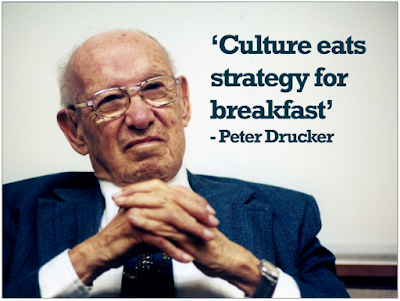
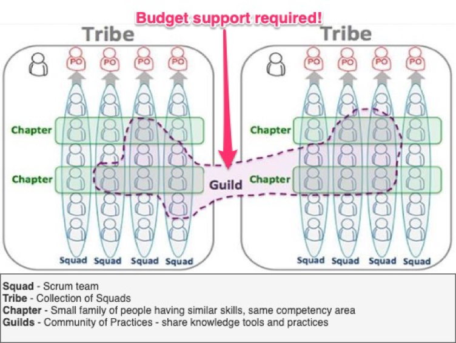
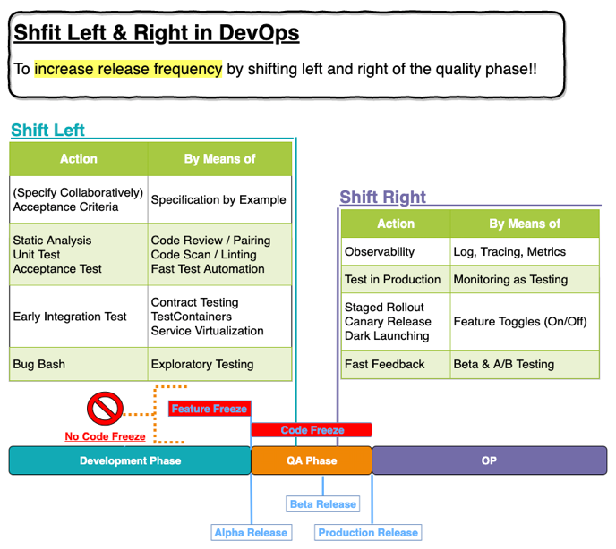

## 何謂 DevOps

DevOps 有太多的定義比如：<a href="https://zh.wikipedia.org/wiki/DevOps" target="_blank">Wikipedia</a>、<a href="https://cloud.google.com/devops/" target="_blank">Google Cloud</a>，這些都表達得很好，但我更喜歡從開發（CI/CD）的角度來講這件事，比如：

> Continuous Delivery is the ability to get changes of all types ... into production, or into the hands of users, safely and quickly in a sustainable way. ... We achieve all this by ensuring our code is always in a deployable state ... thus completely eliminate the integration, testing and hardening phases ... as well as code freezes. ~ <a href="https://continuousdelivery.com/" target="_blank"> Continuous Delivery</a>

要完成這樣的轉變（digital transformation）, 當中包含了不同類別的各項技能之養成<a href="https://cloud.google.com/devops/#devops-capabilities" target="_blank"> DevOps capabilities</a> ，但是在這之前，最難的還是要讓團隊了解及接受改變的必要...

## 為何改變是必需的？

好了，的確有另一些方法可以讓（軟體）開發更快、品質更好、更穩定等等。但我們現也做得不錯，也是能夠固定時間交付客戶所需要的功能，那我還需要改變嗎？？ 這邊就提到了持續改善的重要性，拿Uber[[1]](#ref1)來說，它的商業模式並沒有太多改變，但其架構每兩年就大改一次，這改變不外乎是為了架構能容易擴展（scale out）及<mark>當團隊快速增長時還能維持一樣的開發效率</mark>。企業的起起落落，尤其是IT產業，當改變是被迫時，往往競爭者已攻城掠地，這時改變是壓力很大的，相反的，隨時都能持續改善，反而可以享受著指標數字隨著做為改變而不斷改進的成就感，兩者相差甚巨！

當初 IBM 及微軟內部第一次在推動 DevOps 改造時就是發生在協作軟件的部門（Lotus Notes and MS Office），也正是 Google 的 Gmail[2] 等快速地被企業及個人採用後，兩家公司發現當他們還在以每季度在更新軟件時，Google 卻是每天都能更版甚至使用 A/B Testing 的方法在快速反應使用者的回饋。 結果是 MS Office 轉型後且上了雲端似乎帶來更好的結果，但 IBM 卻退出了企業協作軟件的市場 ......。

> 快速變動的行業裡，大家早就應該了解到，沒有改變的風險跟改變本身的風險是一樣高的！

從十年前的第一場DevOpsDays, Belgium, 2009，到傳統軟體公司想改變時已經是將近五年後的事，但在DevOps滿十年後的今天，你，想要變了嗎？當共享軟体當道，商業模式容易被複製，只要灑錢暫時也能雇用到不錯的工程師，所以長遠來看，企業的差異性與競爭力大概就只剩下企業文化與效率。

### 企業文化

文化將策略當早餐吃掉了（指的是一個企業的文化，將左右其營運管理上的策略。），而快速變化的今天，沒人能預測未來將面臨的所有挑戰，而文化就會像一盞燈指引你走出這些黑暗的隧道。 就像亞馬遜所說：『在客戶體驗方面，我們已經設置了非常高的門檻，並且有著異乎尋常的不斷改進的緊迫感。』因此，『我們要基於長遠創造更好的客戶體驗』、『持續改善以強化其心血。』。

又如 Netflix創辦人Reed Hastings在2009年釋出的 Netflix Culture Deck ，它在 SlideShare 點閱率超過 19,000,000 次，被奉為影響矽谷二十世紀最重要的文件之一，之後其它公司無不公開其企業文化以借此吸引對文化認同之員工及用以過濾跟本身企業不合之應徵者。 文件中有太多對於我們這樣的IT或創意產業所應該有的企業用人留才之策略與認知，也點出了IT產業既無土地，也無廠房，有的只有人，既然只有人那文化的重要性就可見一般了！

> 文化沒有對錯，但卻是讓一家公司在其認知的價值上深耕並做出差異化的必要手段。

文化的重要性，這邊再說個故事：

之於開發團隊，這些著名IT公司的文化中，不外乎一定有的像是：efficiency, risk taking, high performance, seeking excellence...，而這些不就是整個 DevOps 所一直在強調的事嗎？講到 DevOps 有關組織文化的部份，通常就會提到組織學習和安全文化：

#### 學習型組織（Learning Organization）：

持續學習應該也用不著我綴述，但很多公司表面上都提倡這樣的文化，但實際上並沒有積極地去創造一個有利的環境或實質上地支持這類的活動。 如何實踐跟評估組織的學習文化呢？這邊寫得很棒也夠簡單明瞭 <a href="https://cloud.google.com/solutions/devops/devops-culture-learning-culture" target="_blank"> Learning Culture </a>，有興趣就自行參考一下～

另外，如Spotify的分會（Chapter）及工會（Guild）型的架構組織來讓公司內部能更有效率地學習、傳遞知識及實踐工法也蠻值得去嘗試看看。

#### 心理的安全（Psychological Safety）：

面對日益複雜系統，出現問題是不可避免的，我們要做的是快速發現和解決問題，相反地指責只會導至恐俱文化，如此問題可能被隱藏直到災難的發生。另外從Google studies[3] 及 The Westrum organizational culture[4] 裡面都提到心理安全的文化對於建立一個有效率的團隊和創意是至關重要的！

總結一下，對於競爭優勢就如同 Dave West[5]所提及的：
> Peter Senge 在其著作《The Fifth Discipline - The Art & Practice Of The Learning 
> Organization》中描述了組織專注於學習的必要性。
> 「唯一可持續的競爭優勢是一個組織比競爭者更快速地學習的能力」。
> 最終，通過專注於敏捷領導力、自組織、以客戶結果為中心、消除浪費以及瞭解組織文化並頻繁交付這 5 項挑戰，
> 組織將變得更加專注於學習並變得更加敏捷。

### 效率

Nokia Story...

再深再廣的護城河，只要別人的效率是你的兩倍、五倍甚至十倍，那麼護城河也很快就會有被填滿的一天...。
是的，就像 DevOps Handbooks 所提，<mark>『改善日常工作甚至比進行日常工作更重要』</mark>，而且要及早做，而非放到最後，層層堆疊，想改也改不動。
方法就是用 3% ~ 5% 的開發人力或是至少20%的時間週期用於持續改善的活動，這當中就包含了**有意識地（consciously）** 償還技術債及推動技術與架構的現代化。 架構使團隊能够獨立開發、测試及向客户部署價值，減少跨團隊的協作與耦合，其中微服務間能有各自軟體的交付週期便是其中一例！

<mark>↓↓↓ 請仔細讀讀下面這圖的文句 ↓↓↓</mark>

當然，這邊講到的效率提升是奠基在一樣或更好的品質上，你不會為了讓生產力增加十倍而犧牲了品質！對於效率與品質從來就不會是只要求做到七十分就好，而是採用持續改善的方式不斷向上提升，永遠都有進步的空間 <a href="https://en.wikipedia.org/wiki/Toyota_Kata#The_Improvement_Kata" target="_blank">(Toyota Kata)</a>。 是的，改善工作永遠沒有結束的一天，而在這個快速變動的行業裡，大家早就應該了解到，沒有改變的風險跟改變本身的風險是一樣高的！

## 如何開始

實踐方法除了Agile 的 mindset, Scrum process 或是 DevOps Handbooks 中提到的三步工法等，但這些網路上已經有太多好文在講述其中的概念，<mark>所以我更想用技術方面的實作來闡述所需相關的能力</mark>。這些數位化的改革中，工作模式改變最大的就非QA莫屬了，所以從如何 "Align QA jobs to DevOps" 的角度來看，其實更能看出開發團隊要在何處施力才更能達到DevOps的境界。

那為何說 QA 的工作方式有最大的改變呢？ 因為在非 Continuous Delivery 的交付模式中，一定會有幾天的 code freeze，這段時間就是拿來讓 QA 做整合測試的時間，也唯有 QA sign off 的交付才能被佈署至生產線。
想想如果要做到每天一次或多次生產線的交付，那麼生產的流水線當中，其實已經沒有 QA 能手動測式的空檔了... 所以這些 QA的角色可能會消失，但有關質量的工作事項卻只會更多且散落在各個開發的週期中（詳見『測試在 DevOps 中的樣子』章節），也正是所謂的測試左移或右移。

再接下去的幾個章節中，會對這些實踐做更多的闡述或實作方法（很多方法其實跟你想的不一樣），包括有：

- 測試在 DevOps中的樣子
- 持續集成（Continuous Integration）
- 單主幹開發（Trunk-based Development & Feature Toggles）
- 測試左移（在開發階段之前定義好測試以及將整合測試提前執行）
  - 實例化需求（Specification by Examples）
  - 測試自動化（Fast Test Automation）
    - API 測試？ 想想 Consumer Driven Contract Testing
    - 想更快？ 先做好 Test Isolation
    - 自動化測試戰略與工具（Strategy & Tools）

- 測試右移（在生產環境中監控，並且實時穫取用户反饋）
  - Low Risk Deployment（低風險部署）
  - Testing in Production（在生產環境做測試）
  - Application Observability（O11y，程式的可觀察性）

待續，持續更新中 ...

## Reference

1. Stack History: [A Timeline of Uber's Tech Stack Evolution](https://stackshare.io/stack-history-timeline-uber-tech-stack-evolution)
2. Developing Gmail’s New Look — [Google Blog](https://medium.com/@thysniu/feature-flags-release-small-and-often-simplify-workflow-19d92fe0c2a5)
3. [Google studies](https://diversity.lbl.gov/2019/05/13/the-quest-to-build-the-most-effective-teams/)
4. [Westrum organizational culture](https://cloud.google.com/solutions/devops/devops-culture-westrum-organizational-culture)
5. Dave West. [Managing next century agile.](https://www.infoq.cn/article/managing-next-century-agile/)
6. [IBM selling Lotus Notes/Domino business to HCL](https://techcrunch.com/2018/12/07/ibm-selling-lotus-notes-domino-business-to-hcl-for-1-8b/)

> Culture is how we think, what habits we create and what we do when we're interacting with each other every day.