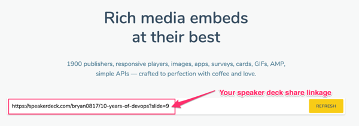

There are many ways to embeded different media type contents in Gatsby, here is the easiest one which just leverages the iframe wrapper.

Step 1. Install gatsby-remark-responsive-iframe official plugin

Check [here](https://www.gatsbyjs.org/packages/gatsby-remark-responsive-iframe/) for instruction.

Step 2. Get url of your Speakerdeck slide which you want to share


Step 3. Get embeded html code from [iframely](https://iframely.com/embed)



Step 4. Paste the generated code in your index.md
```javascript
<div style="left: 0; width: 100%; height: 0; position: relative; padding-bottom: 56.1972%;">
  <iframe src="https://speakerdeck.com/player/cf04f08b30f54c41ad76d0b180effd0b?slide=9"
    style="border: 0; top: 0; left: 0; width: 100%; height: 100%; position: absolute;"
    allowfullscreen scrolling="no" allow="encrypted-media">
  </iframe>
</div>
```
Step 5. Run your site in Gatsby develop mode and check the result!

```shell
  $ gatsby develop
```

## The embeded speakerdeck sample

<div style="left: 0; width: 100%; height: 0; position: relative; padding-bottom: 56.1972%;">
  <iframe src="https://speakerdeck.com/player/cf04f08b30f54c41ad76d0b180effd0b?slide=9"
    style="border: 0; top: 0; left: 0; width: 100%; height: 100%; position: absolute;"
    allowfullscreen scrolling="no" allow="encrypted-media">
  </iframe>
</div>
